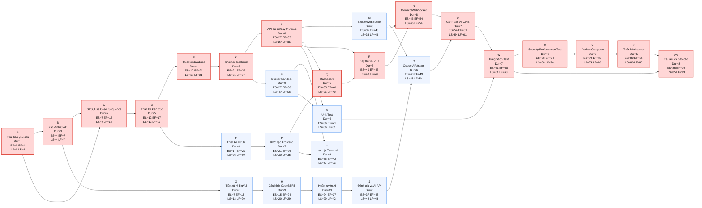

# Sơ đồ AON và đường găng dự án

Quy ước tính toán:
* Đơn vị thời gian: ngày làm việc.
* ES: thời gian bắt đầu sớm.
* EF: thời gian kết thúc sớm.
* LS: thời gian bắt đầu muộn.
* LF: thời gian kết thúc muộn.
* Slack = LS - ES. Công việc có Slack = 0 thuộc đường găng.

## Bảng thông tin nút AON

| Ký hiệu | Công việc | Duration | ES | EF | LS | LF | Slack | Trạng thái |
|---|---|---:|---:|---:|---:|---:|---:|---|
| A | Thu thập yêu cầu hệ thống từ bài toán DevSecOps | 4 | 0 | 4 | 0 | 4 | 0 | Găng |
| B | Xác định danh mục CWE cần phát hiện | 3 | 4 | 7 | 4 | 7 | 0 | Găng |
| C | Lập tài liệu SRS, Use Case, Sequence | 5 | 7 | 12 | 7 | 12 | 0 | Găng |
| D | Thiết kế kiến trúc tổng quan | 5 | 12 | 17 | 12 | 17 | 0 | Găng |
| E | Thiết kế database ERD và cấu trúc lưu trữ | 4 | 17 | 21 | 17 | 21 | 0 | Găng |
| F | Thiết kế UI/UX cho Editor, Terminal, Dashboard | 4 | 17 | 21 | 26 | 30 | 9 | Không găng |
| G | Tiền xử lý dữ liệu BigVul | 8 | 7 | 15 | 12 | 20 | 5 | Không găng |
| H | Cấu hình CodeBERT và đầu ra đa nhiệm | 9 | 15 | 24 | 20 | 29 | 5 | Không găng |
| I | Huấn luyện mô hình AI | 13 | 24 | 37 | 29 | 42 | 5 | Không găng |
| J | Đánh giá F1-score và đóng gói AI API | 6 | 37 | 43 | 42 | 48 | 5 | Không găng |
| K | Khởi tạo Backend, DB, Entity, JWT/Session | 6 | 21 | 27 | 21 | 27 | 0 | Găng |
| L | Xây dựng API quản lý dự án và cây thư mục | 8 | 27 | 35 | 27 | 35 | 0 | Găng |
| M | Message Broker và WebSocket đồng bộ mã nguồn | 8 | 35 | 43 | 38 | 46 | 3 | Không găng |
| N | Docker Client, Sandbox và Terminal I/O | 9 | 27 | 36 | 47 | 56 | 20 | Không găng |
| O | Hàng đợi gọi AI Server và stream kết quả | 6 | 43 | 49 | 48 | 54 | 5 | Không găng |
| P | Khởi tạo Frontend, TailwindCSS, Router, layout IDE | 5 | 21 | 26 | 30 | 35 | 9 | Không găng |
| Q | Dashboard quản lý dự án và form tạo mới | 5 | 35 | 40 | 35 | 40 | 0 | Găng |
| R | Cây thư mục đệ quy và Context Menu | 6 | 40 | 46 | 40 | 46 | 0 | Găng |
| S | Monaco Editor, auto-complete, đồng bộ WebSocket | 8 | 46 | 54 | 46 | 54 | 0 | Găng |
| T | xterm.js và WebSocket riêng cho Terminal | 6 | 36 | 42 | 87 | 93 | 51 | Không găng |
| U | Cảnh báo AI, highlight lỗi, panel CWE | 7 | 54 | 61 | 54 | 61 | 0 | Găng |
| V | Unit Test Backend và Docker Service | 5 | 36 | 41 | 56 | 61 | 20 | Không găng |
| W | Integration Test Frontend -> AI Server | 7 | 61 | 68 | 61 | 68 | 0 | Găng |
| X | Security & Performance Test WebSocket và Docker Sandbox | 6 | 68 | 74 | 68 | 74 | 0 | Găng |
| Y | Kết nối module và đóng gói Docker Compose | 6 | 74 | 80 | 74 | 80 | 0 | Găng |
| Z | Triển khai hệ thống lên server chạy thử | 5 | 80 | 85 | 80 | 85 | 0 | Găng |
| AA | Hoàn thiện tài liệu kiến trúc và báo cáo PBL | 8 | 85 | 93 | 85 | 93 | 0 | Găng |

## Sơ đồ AON



## Đường găng

Đường găng của dự án:

```text
A -> B -> C -> D -> E -> K -> L -> Q -> R -> S -> U -> W -> X -> Y -> Z -> AA
```

Tổng thời gian đường găng:

```text
4 + 3 + 5 + 5 + 4 + 6 + 8 + 5 + 6 + 8 + 7 + 7 + 6 + 6 + 5 + 8 = 93 ngày làm việc
```

Kết luận: thời gian hoàn thành sớm nhất của dự án là **93 ngày làm việc**, tương đương khoảng **18.6 tuần**, nằm trong yêu cầu **5 tháng** nếu các công việc song song được thực hiện đúng theo lịch.
